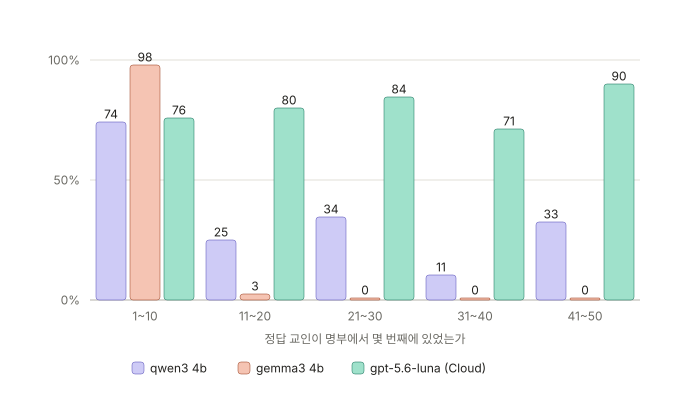
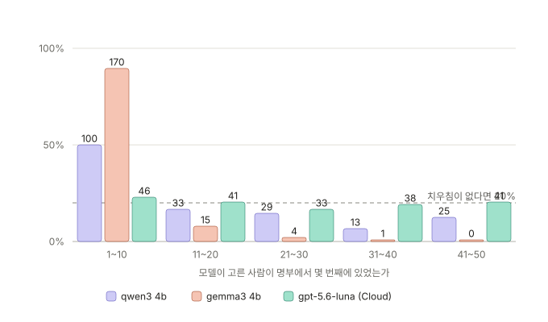
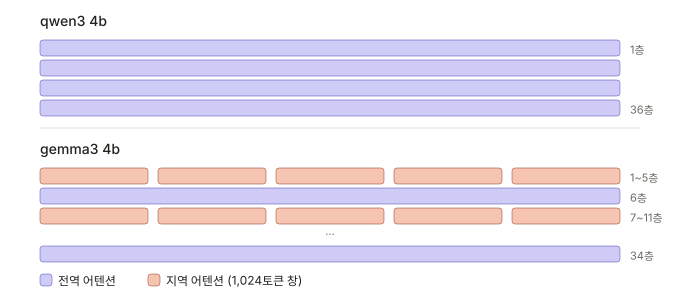
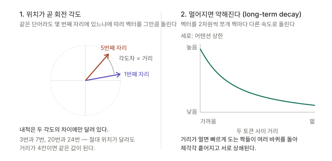

# 문제 분석 1 - 중간 실종 현상?? ([Lost in the Middle](https://aclanthology.org/2024.tacl-1.9/))

긴 입력에서 모델이 앞(primacy)과 뒤(recency)는 잘 보지만 **가운데 정보를 놓치는 현상**이 있다. 
RoPE 위치 인코딩의 장거리 감쇠, 또는 학습 데이터의 검색 요구 성격에서 나온다고 설명된다.
(RoPE가 무엇인지는 [문서 맨 아래 부록](#rope) 참고)

우리 프롬프트는 교인 50명이 일렬로 들어가고 정답 10명이 무작위 위치에 흩어져 있다. 위치 편향이 작동한다면 **가운데 정답을 유독 많이 놓쳤을** 것이다.


## 결과



| 정답 위치 | qwen3 4b | gemma3 4b | gpt-5.6-luna |
|---|---|---|---|
| 1~10번째 | 74.0% (37/50) | **98.0%** (49/50) | 76.0% (38/50) |
| 11~20번째 | 25.0% (10/40) | **2.5%** (1/40) | 80.0% (32/40) |
| 21~30번째 | 34.4% (11/32) | **0.0%** (0/32) | 84.4% (27/32) |
| 31~40번째 | 10.5% (4/38) | **0.0%** (0/38) | 71.1% (27/38) |
| 41~50번째 | 32.5% (13/40) | **0.0%** (0/40) | 90.0% (36/40) |
| 전체 | 37.5% | 25.0% | 80.0% |

`qwen3 4b`는 뚝 떨어졌다가 마지막에 조금 반등한 모양새
`gemma3 4b`는 아예 뚝 떨어진 모양새 
`gpt-5.6-luna`는 71~90%로 위치와 무관하게 고른 모양새 


### 위치별로 몇 명을 골랐나



| 위치 | qwen3 4b | gemma3 4b | gpt-5.6-luna |
|---|---|---|---|
| 1~10번째 | 100명 (50.0%) | **170명 (89.5%)** | 46명 (23.1%) |
| 11~20번째 | 33명 (16.5%) | 15명 (7.9%) | 41명 (20.6%) |
| 21~30번째 | 29명 (14.5%) | 4명 (2.1%) | 33명 (16.6%) |
| 31~40번째 | 13명 (6.5%) | 1명 (0.5%) | 38명 (19.1%) |
| 41~50번째 | 25명 (12.5%) | **0명 (0.0%)** | 41명 (20.6%) |


`gpt-5.6-luna`는 16.6~23.1%로 그 선에 붙어 있다. 명부를 끝까지 읽었다는 뜻이다.
`gemma3 4b`는 앞 10명에서 89.5%를 가져가고 뒤 10명은 **한 명도 고르지 않았다.**
`qwen3 4b`는 50%로 그 중간이다.


## gemma3-4b는 편향이 아니라 아예 정보를 잃어버린 느낌.

| 정답 위치 | 정답 적중 | 적중률 | 고른 수 | 선택률 |
|---|---|---|---|---|
| 1~5번째 | 22/22 | 100.0% | 83 | 41.5% |
| 6~10번째 | 27/28 | 96.4% | 86 | 43.0% |
| 11~15번째 | 1/18 | 5.6% | 12 | 6.0% |
| 16~20번째 | 0/22 | 0.0% | 3 | 1.5% |
| 21~25번째 | 0/14 | 0.0% | 0 | 0.0% |
| 26~30번째 | 0/18 | 0.0% | 4 | 2.0% |
| 31~35번째 | 0/22 | 0.0% | 1 | 0.5% |
| 36~40번째 | 0/16 | 0.0% | 0 | 0.0% |
| 41~45번째 | 0/20 | 0.0% | 0 | 0.0% |
| 46~50번째 | 0/20 | 0.0% | 0 | 0.0% |


## qwen3-4b는 정보의 세기가 줄어든 느낌.

| 정답 위치 | 정답 적중 | 적중률 | 고른 수 | 선택률 |
|---|---|---|---|---|
| 1~5번째 | 12/22 | 54.5% | 39 | 19.5% |
| 6~10번째 | 25/28 | 89.3% | 61 | 30.5% |
| 11~15번째 | 8/18 | 44.4% | 27 | 13.5% |
| 16~20번째 | 2/22 | 9.1% | 6 | 3.0% |
| 21~25번째 | 2/14 | 14.3% | 13 | 6.5% |
| 26~30번째 | 9/18 | 50.0% | 16 | 8.0% |
| 31~35번째 | 2/22 | 9.1% | 8 | 4.0% |
| 36~40번째 | 2/16 | 12.5% | 5 | 2.5% |
| 41~45번째 | 9/20 | 45.0% | 13 | 6.5% |
| 46~50번째 | 4/20 | 20.0% | 12 | 6.0% |

gemma3처럼 끊기지 않는다. **끝까지 0이 되지 않고 9~50% 사이를 오르내린다.**

그리고 **중간이 특별히 낮지 않다.** 26~30번째가 50.0%로 1~5번째(54.5%)와 비슷하고,
가장 낮은 구간은 16~20·31~35번째로 앞뒤 어디에도 몰려 있지 않다.

**이건 Lost in the Middle이 아니다.** 앞쪽에 힘이 실리고 정보가 사라진 것이 아니라 **세기가 약해져 판단이 불안정해진 것**에 가깝다.

## 혹시 문서가 잘렸나?

입력이 컨텍스트 한도를 넘겨 뒤쪽이 잘렸나? -> No.

| 모델 | 입력 토큰 | 입력+출력 | `num_ctx` 16,384 대비 | 모델 카드상 한도 |
|---|---|---|---|---|
| qwen3 4b | 10,164~10,747 | 11,679 | 71% | 262,144 |
| gemma3 4b | 9,240~9,745 | **10,794** | **66%** | 131,072 |
| gpt-5.6-luna | 8,982~9,451 | 11,181 | 68% | — |

세 모델 모두 설정한 `num_ctx`의 70% 안쪽이고, **gemma3가 오히려 가장 여유롭다.**
`prompt_eval_count`가 9,240~9,745로 잡혔다는 것은 gemma3가 50명 전부를 실제로 토큰화해 받았다는 뜻이다.

**한도에 걸려 못 본 것이 아니라, 다 받아놓고 안 쓴 것**


## 해석

둘 다 못하지만 gemma가 더 못하는 건 아마도 구조 때문??...

### 두 모델의 어텐션 구조



| | qwen3 4b | gemma3 4b |
|---|---|---|
| 층 수 | 36 | 34 |
| 어텐션 | **모든 층이 전역** (GQA) | **지역 5 : 전역 1** 로 교차 |
| 지역 층 창 | 없음 | 1,024토큰 (교인 약 5명) |
| 전역 층 수 | 36개 전부 | **5~6개** (계산값) |
| 어텐션 헤드 | **32** (KV 8) | **8** (KV 4) |
| RoPE base | 5,000,000 | 지역 10,000 / 전역 1,000,000 |

전역 층 수는 문서에 나오지 않는다. `block_count = 34`에 5:1 비율을 적용하면 6층 주기가
5번(30층) 돌고 4층이 남는다. 남는 4층이 어떻게 배치되는지는 기술 보고서에도 모델 카드에도
없어 **5~6개로만 말할 수 있다.**


### 조심스러운 결론 — 지역 어텐션을 섞은 모델은 이 과제에 불리해 보인다

우리 과제는 50명을 **한 번에 놓고** 서로 견줘야 하는 일이다. 25번째 교인이 3번째 교인보다 급한지 판단하려면 두 정보가 한자리에서 만나야 한다. gemma의 경우 전체데이터가 아닌 일부 데이터의 특성을 파악한 뒤 그 결과값으로 결과를 도출하는 과정에서 전체 데이터 안에서의 순위를 비교하는 기능이 결여된 것이 아닐까 생각한다.

#### 반론 — 이 결론으로 버티기 어려운 이유

**1. 훑다가 멈추는 것일 수 있다.**

모델은 top 10을 위에서부터 순서대로 생성한다. 명부를 앞에서 읽으며 쓸 만한 사람을 담다가
**10명이 차면 더 안 보는** 것일 수 있다. 그러면 구조와 무관하게 같은 패턴이 나온다.

실제로 **두 모델 다 완만한 내리막이 아니라 문턱**이다.

| | 끊기는 지점 | 그 앞 선택률 | 그 뒤 선택률 |
|---|---|---|---|
| gemma3 4b | 10명 ↔ 11명 | 84.5% (1~10번째) | 6.0% (11~15번째) |
| qwen3 4b | 15명 ↔ 16명 | 63.5% (1~15번째) | 3.0% (16~20번째) |

**qwen3에도 문턱이 있다.** 1~15번째가 선택의 63.5%를 가져가고 16번째부터는 전부 한 자릿수다.
qwen3는 지역 층이 없는데도 그렇다. 구조 차이로는 이 공통점이 설명되지 않는다.

**2. 지시문이 앞에만 있다.**

지시문이 맨 앞이고 뒤는 전부 명부다. 문제가 "멀어서 못 본다"가 아니라 **"과제가 뒤까지
안 닿는다"**일 수 있다. 비슷해 보이지만 대응이 다르다.

**3. 어텐션 헤드 수가 4배 차이다.**

| | qwen3 4b | gemma3 4b |
|---|---|---|
| `attention.head_count` | **32** | **8** |
| `attention.head_count_kv` | 8 | 4 |

헤드는 서로 다른 기준으로 찾아보는 통로다. 50명을 견주려면 출석·건강·경조사를 동시에 봐야
한다. **층 구조보다 헤드 수가 더 큰 변수일 수 있다.**

**4. 지역 층이 쌓이면 닿는 범위가 넓어진다.**

지역 층 하나는 1,024토큰만 보지만 층이 쌓이면 간접적으로는 더 멀리 닿는다. 거기에 전역 층이
5~6개 따로 있다. **"부분만 보고 판단한다"는 표현은 과장일 수 있다.**

**5. 한국어 처리 능력.**

명부가 전부 한국어다. 두 모델의 한국어 학습량이 다르다. 긴 한국어 문서에서 gemma3가 불리한
것이라면 구조와 무관하다.

#### 싸게 가리는 방법

**명부 순서를 뒤집어 한 번 돌리면 반론 1이 갈린다.**

| 결과 | 결론 |
|---|---|
| 뒤집어도 새 순서의 앞쪽을 고른다 | 훑다가 멈추는 것. 구조 탓이 아니다 |
| 뒤집으니 원래 뒤에 있던 사람을 고른다 | 순서가 아니라 사람을 보고 골랐다 |

`members` 리스트를 뒤집는 한 줄이면 되고 로컬 20회면 된다. 지시문을 맨 뒤로 옮겨 돌리면
반론 2가 갈린다.

**지금은 위 다섯 가지를 하나도 배제하지 못했다.** 구조 때문이라는 것은 가설이지 결론이 아니다.

### 다음 스텝?
일단 300명 이상의 사람의 1년치 데이터를 받을 수 있으려면 모델 크기가 더 커야하는데
만약 충분히 큰 컨텍스트를 받아들일 수 있는 모델을 쓸 수 없으면 어떻게 해야할까?.

일단 qwen3 8b고고!

---

<a id="rope"></a>

## 부록 — RoPE란(Rotary Position Embedding)

> **왜 남기나.**  정보 전달이 왜 마지막 층까지 안 가나 이것 저것 찾으며 고민하다가.. 만난 개념. 공부한게 아쉬워서 남김

### 기본 개념
순서를 반영하는데 이 때 절대 거리가 아닌 상대 거리 개념으로 반영하는 방식.

### 어떻게 반영하나

**벡터를 회전시킨다.** 더하는 게 아니라 돌린다.



각 토큰의 벡터를 **위치에 비례한 각도만큼 회전**시킨다. 
고차원 벡터를 2차원 공간들로 쪼개어 회전 행렬을 곱해 회전시키는 방식


### 이게 왜 동작하나
어텐션은 두 벡터(쿼리와 키벡터)의 **내적**을 계산하는데, 회전한 두 벡터의 내적에 **두 각도의 차이**가 반영된다.

```
위치 3의 질의 · 위치 7의 키   → 각도차 4θ
위치 20의 질의 · 위치 24의 키 → 각도차 4θ    같은 값
```

절대 위치가 어디든 거리가 4칸이면 같은 상대거리 값이 반영되어 나옴.
현대 대형 언어 모델의 표준으로 자리매김한 위치 인코딩 기법.

### 왜 멀면 약해지나

RoPE는 벡터를 2차원씩 쪼개서 **짝마다 다른 속도로 돌린다.**

| 짝 | 회전 속도 | 역할 |
|---|---|---|
| 앞쪽 짝 | 빠르게 | 가까운 거리 구분 (1칸 vs 2칸) |
| 뒤쪽 짝 | 느리게 | 먼 거리 구분 (100칸 vs 200칸) |

거리가 멀어지면 빠르게 도는 짝들이 **여러 바퀴를 돌아 제각각 흩어진다.** 어떤 짝은 +방향,
어떤 짝은 −방향을 가리켜 서로 상쇄된다. 그 결과 거리가 멀수록 내적의 상한이 줄어든다.
RoFormer 논문이 이를 증명했고 `long-term decay`라 부른다.

### base 값이 크면 무슨 뜻인가

회전 각도는 `위치 / base^(2i/d)` 꼴로 정해진다. **base가 클수록 전체적으로 천천히 돈다.**
천천히 돌면 먼 거리에서도 각도가 덜 흩어져 감쇠가 완만해진다. 긴 입력을 다루려고 base를
키우는 것이 이 때문이다.

| 모델 | base | 뜻 |
|---|---|---|
| gemma3 지역 층 | 10,000 | 빠르게 돈다. 1,024토큰 창 안만 보면 되니 먼 거리를 구분할 필요가 없다 |
| gemma3 전역 층 | 1,000,000 | 느리게 돈다. 전체를 봐야 하니 먼 거리도 구분해야 한다 |
| qwen3 4b | 5,000,000 | 더 느리게 돈다 |
| qwen3 8b | 1,000,000 | 4b보다 빠르게 돈다 |

**같은 모델 안에서도 층의 역할에 따라 값을 다르게 준다.** gemma3의 100배 차이가 그 예다.

### 이 실험에서는 설명이 되지 않았다

qwen3 4b는 RoPE를 쓰고 base도 5,000,000으로 크게 잡혀 있다. 감쇠 이론대로면 뒤로 갈수록
단조롭게 떨어져야 하는데, 26~30번째가 1~5번째보다 높게 나왔다.

**감쇠는 배경 조건이지 이 결과의 원인이 아니다.** 원인 후보로는 어텐션 구조, 모델 규모,
학습 방식이 남아 있고 이 실험으로는 분리하지 못했다.

---

## 참고 자료

**현상**

- [Lost in the Middle: How Language Models Use Long Contexts](https://aclanthology.org/2024.tacl-1.9/) — TACL 2024

**모델 구조 (그림의 근거)**

- [Gemma 3 Technical Report](https://arxiv.org/pdf/2503.19786) — 지역 5 : 전역 1 교차, 지역 층 1,024토큰 창, 층별 RoPE base 10,000 / 1,000,000
- [Gemma explained: What's new in Gemma 3](https://developers.googleblog.com/gemma-explained-whats-new-in-gemma-3/) — Google Developers Blog
- [Welcome Gemma 3](https://huggingface.co/blog/gemma3) — Hugging Face
- [Qwen3 Technical Report](https://arxiv.org/html/2505.09388v1) — 모든 층 전역 어텐션(GQA), RoPE 사용

**위치 인코딩**

- [RoFormer: Enhanced Transformer with Rotary Position Embedding](https://arxiv.org/abs/2104.09864) — RoPE 원 논문, long-term decay

**직접 확인한 값**

각 모델의 `block_count`, `attention.sliding_window`, `rope.freq_base`, `context_length`는
`ollama show`의 `modelinfo`에서 읽었다.

```bash
ollama show gemma3:4b
ollama show qwen3:4b-instruct-2507-q4_K_M
```
